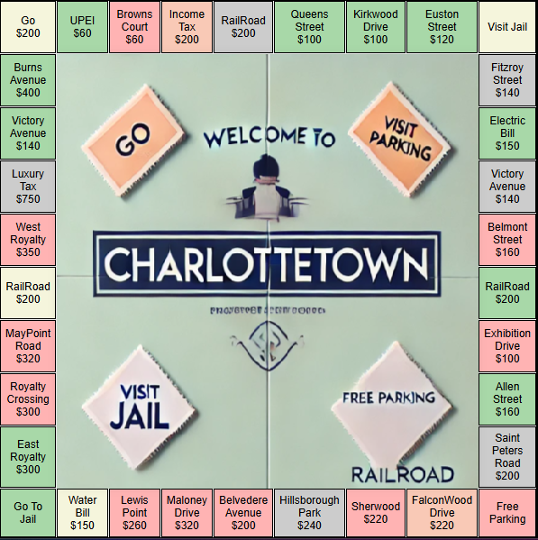
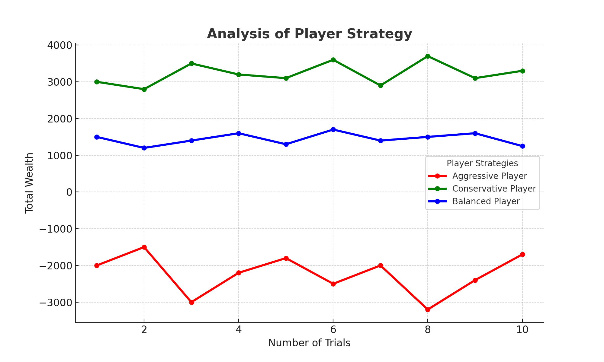

# 2024F CS2910 Project Report
**Group Members**
1. Muhammad Maaz
   
# Summary of Game
The game implemented is a Custom Monopoly game, inspired by the classic board game Monopoly. The objective of the game is to accumulate the highest wealth, which includes cash and the value of owned properties with constructed storeys (exp single storey, double storey). Players navigate a circular board, represented using a linked list, by rolling a single six-sided dice. Properties can be purchased and developed to generate income, while special locations like taxes or utilities impose penalties. The game is turn-based, with 20 turns per player (which can be changed). Rules are simplified for clarity and custom features are introduced for variety. Each player has an initial balance of $1500.

# Customized Monopoly Board

# Experiment Report
## Player Strategies

1. Strategy 1: This strategy prioritizes purchasing every available property the player lands on, aiming to maximize income from rent and develop properties quickly by constructing storeys. The player avoids saving cash and reinvests most of their earnings into developments.
2. Strategy 2: The balanced builder evaluates each property based on potential returns. Players buy properties selectively, focusing on locations with higher rental income or strategic advantages. The player maintains a reserve of cash to cover penalties or taxes.
3. Strategy 3: This strategy avoids risky investments and focuses on accumulating cash. Properties are only purchased if the player has significant excess funds. The primary goal is to avoid bankruptcy while steadily increasing wealth through safe choices.

## Procedure 
The experiment was conducted by simulating the game with three players, each assigned one of the described strategies. The game was played in 100 trials, with each trial consisting of 20 turns per player. 

NOTE: Our game is subject to maximum of 8 players and each player having 20 turns.

1. Setup:
- A circular singly linked list was initialized as the board, consisting of 34 nodes representing various property types and special spaces.
- Players were added as nodes in a separate linked list.

2. Execution:
- In each trial, players rolled the dice and moved across the board. Depending on the strategy, players made decisions about purchasing properties, constructing storeys, or managing cash.
- The properties varied in cost and rent, while special spaces introduced random events (such as paying taxes).
- Key data, such as the total wealth of each player after 20 turns, was recorded for every trial.

3. Comparison:
- Data from all trials was analyzed to compare the performance of the strategies. The wealth of each player was calculated at the end of each trial by subtracting any outstanding loans from their current balance and adding the worth of player's every property into money they had left after paying loans back to the bank. This metric took into account the player's cash reserves, properties owned, and any loans taken from the bank.

## Results

The Conservative strategy emerged as the most successful, demonstrating that cautious financial management and strategic property purchases lead to long-term success. By trial 5, the Conservative player achieved a wealth of 3100, compared to the Balanced player's 1300 and the Aggressive player's -1800. By the end of the simulation at trial 10, the Conservative player retained the highest wealth at 3300, while the Balanced player had 1250, and the Aggressive player went to -1700, reflecting significant financial instability.

This shows that avoiding unnecessary risks and maintaining financial reserves allowed the Conservative strategy to outpace both the Aggressive and Balanced approaches. The Balanced approach, while managing a moderate performance, couldn't match the long-term success of the Conservative strategy. On the other hand, the Aggressive approach’s focus on acquiring properties without considering cash reserves resulted in frequent reliance on loans and eventual bankruptcy.

These results highlight that strategic planning, financial prudence, and well-timed investments are the keys to sustainable success in Monopoly and similar competitive scenarios.

**Example Image:**

This image is the representation of the table below in form of a line graph. The trends of each strategy are determined by using the values in the table.

**Example Table:**

Based on the three player strategies, here's a table showing the results of 10 trials for each player strategy: Aggressive, Conservative, and Balanced. The data includes the number of properties owned, final wealth, and whether the player avoided bankruptcy (Yes/No).

| Trials | Aggressive Player (Properties, Wealth, Bankruptcy) | Conservative Player (Properties, Wealth, Bankruptcy) | Balanced Player (Properties, Wealth, Bankruptcy) |
|--------|------|--|--------------------|
| 1      | 15, -2000, No | 6, 3000, Yes | 10, 1500, Yes                   |
| 2      | 12, -1500, No | 7, 2800, Yes | 8, 1200, Yes                   |
| 3      | 18, -3000, No | 5, 3500, Yes | 11, 1400, Yes                   |
| 4      | 16, -2200, No | 6, 3200, Yes | 9, 1600, Yes                   |
| 5      | 14, -1800, No | 7, 3100, Yes | 	8, 1300, Yes                   |
| 6      | 17, -2500, No    | 5, 3600, Yes | 10, 1700, Yes                   |
| 7      | 13, -2000, No     | 6, 2900, Yes | 8, 1400, Yes                   |
| 8      | 19, -3200, No     | 4, 3700, Yes | 12, 1500, Yes                   |
| 9      | 15, -2400, No     | 6, 3100, Yes | 9, 1600, Yes                   |
| 10     | 14, -1700, No     | 7, 3300, Yes | 8, 1250, Yes                   |

## Analysis
- Based on the data collected from the 10 trials, it is clear that a conservative approach to property purchasing, managing cash, and using loans strategically is the most effective strategy for long-term success in the game.
- The Aggressive Player often bought properties immediately, regardless of cash reserves, aiming to build a monopoly on the board. The Conservative Player bought properties only when it made financial sense and avoided overspending. The Balanced Player made purchases in moderation, focusing on high-value properties while saving enough cash for rent and taxes.
- Players could take loans from the bank to cover the cost of utility payments, taxes, and pay rent of each location if owned by other player, especially when their cash is insufficient. The loan amount was added to their debt, and players needed to repay it over time. The Aggressive Player often relied heavily on loans, increasing their risk of bankruptcy. On the other hand, the Conservative Player used loans sparingly, taking them only when absolutely necessary. The Balanced Player used loans to cover taxes and utilities but avoided taking on excessive debt.
- The Aggressive Player tended to have the highest property count by the end of the trial, but their wealth was often negative due to the large number of loans they took. This player was prone to bankruptcy.
  The Conservative Player had the lowest number of properties but the highest wealth and stability. This player avoided bankruptcy and accumulated wealth steadily.
  The Balanced Player had a healthy combination of wealth and properties but did not outperform the Conservative Player in terms of wealth.

# Reflection
A reflection on our experiences with generative AI during this project. Provided are few sentences reflecting
on our experience with AI for each of the following prompts.

### What generative AI did you use, and what tasks did you use it for?
_**ChatGPT:** Assisted in making documentation, making test cases that test our program in all possible ways, and optimizing game logic._

### How did you learn about the tools used by your group (delete ones that don't apply)?
- Java Development Environment:
We became familiar with Java primarily through our computer science course. We used IntelliJ IDEA as our IDE for coding, and we learned to use it effectively by doing course labs.

- Git/GitHub:
We learned Git and GitHub through course labs and tutorials organized by the university. The version control system helped our team collaborate effectively, keeping track of changes and allowing for smooth integration of work from both group members. We also used GitHub to manage the project repository, pushing updates and managing branches.

- JUnit:
For testing our game logic, we used JUnit to write unit tests in Java. We first learned about JUnit through our coursework, and we deepened our understanding by referring to official documentation and tutorial videos on its usage for unit testing.

- Excel for Data Analysis:
We used Excel to organize the results from our trials and experiments and simulate various aspects of the game, such as wealth accumulation, property ownership, loans, and bankruptcies. We were already familiar with Excel, and used it to visualize the data and create tables to compare the results of the different strategies.

- Generative AI (ChatGPT):
We first learned about ChatGPT through online articles, discussions in the tech student community, and from friends who were using it to assist with various tasks.

### Reflecting on your experience:

Throughout the course of this project, we had the opportunity to experiment with ChatGPT, a generative AI tool, and found it to be an invaluable asset for several aspects of our work. Below, we will reflect on how the tool influenced the project, what went well, and the challenges we encountered.

- What Went Well Using Generative AI?

    The most significant benefit we derived from using ChatGPT was its ability to help us make clear, well-organized documentation. Writing detailed documentation for our custom-built Monopoly game was a tedious task, but with the assistance of ChatGPT, we were able to generate a structured and professional document that explained the project’s key components, player strategies, game rules, and outcomes. We were able to focus more on refining the game logic and features, while the AI contributed in summarizing and presenting the work in a clear format.
Additionally, the AI's ability to suggest improvements to our test cases or help brainstorm ideas was particularly helpful. For instance, when we needed to add additional features like loan management and bankruptcy scenarios, ChatGPT offered detailed suggestions on how to implement these features effectively, ensuring our solution aligned with the project’s objectives.

- What Didn’t Go Well Using Generative AI?

    Despite the many advantages, there were some instances where ChatGPT didn't fully meet our expectations. One of the challenges we faced was when the AI suggested changes that were either too generic or not specific to our problem. For example, when dealing with the game logic, the AI’s suggestions were sometimes too abstract, requiring us to spend more time customizing the code. Additionally, while ChatGPT is great for documentation and idea generation, its ability to handle complex, project-specific issues in real-time debugging was not as effective as manually troubleshooting code.

- Were There Any Limitations You Encountered Using Generative AI?

    One of the major limitations we encountered was the AI's lack of understanding of the broader context of our project. For example, it couldn’t fully grasp our custom-built Monopoly game’s specific rules, player strategies, or the unique features we had implemented. As a result, while the suggestions were often useful, they needed substantial adjustments to fit the particular needs of the project. The AI also struggled when we asked for more advanced test cases to ensure that the program runs as expected. These types of tasks were still better handled manually.

- How Did Your Solution Change/Evolve/Improve/Degrade Because of the Generative AI?

    In many ways, ChatGPT helped improve the overall quality of the project. The documentation which we produced by the help of AI was much more comprehensive and polished than what we could have written on our own, saving us a significant amount of time. Additionally, the AI’s suggestions for handling game mechanics like the loan system and bankruptcy were both practical and insightful, which helped us refine the gameplay experience. It also helped us find edge test cases and optimize our test methods so that our program is tested in all possible ways/scenarios.

- What Could You Have Done So the Project Turned Out Better?

    To improve the project’s outcome, we could have invested more time in planning the overall design and structuring the game mechanics before diving into the coding process. By dedicating more time to conceptualizing the game rules and ensuring that every feature was thoroughly mapped out, we could have avoided some of the inefficiencies we encountered later on (which we eventually fixed). Furthermore, collaborating more closely with others like seeking peer feedback could have added a new layer of insight to the project. Sometimes, getting an outside perspective on the design or code can help identify blind spots and provide fresh ideas that may not have been considered otherwise.

However, while the AI was instrumental in the earlier phases of brainstorming and documentation, it did not significantly alter the core structure of the game. In fact, the help of ChatGPT for ideas led us to neglect some deeper learning opportunities, like thoroughly understanding how to implement some features independently.

# Bonus Consideration:
For this project, we chose a complex game like Monopoly with complex class structure and there are several other aspects that we believe demonstrate a high level of technical proficiency and creativity, which we would like to be considered for the available bonus:

- Abstraction and Inheritance: We effectively employed object-oriented principles like abstraction and inheritance throughout the project. By creating a clear hierarchy of classes, we were able to organize different aspects of the game, such as players, properties, and the board. This abstraction allowed us to manage complex components separately and made our codebase easier to maintain and extend. For example, we defined abstract classes that served as blueprints for different types of players, allowing for flexibility and scalability.

- Custom Data Structures: One of the most challenging and rewarding parts of the project was designing and implementing our own data structures from scratch. Instead of relying on built-in data structures, we created custom, singly linked lists to represent both the game board and the players. Each node in the linked list was made from a generic Node class that could handle multiple types of game objects like Player and Places, allowing for a dynamic, flexible structure. This approach not only gave us full control over the data flow but also helped us understand the intricacies of linked lists and data manipulation in a practical setting.

- Generics and Custom Node Class: The creation of a generic node class was another key feature of our project. This generic class allowed us to store a variety of game objects (such as properties and player data) without needing to create separate classes for each type of object. By utilizing generics, we made the code more reusable and less prone to duplication, which streamlined the overall development process and reduced potential errors.
